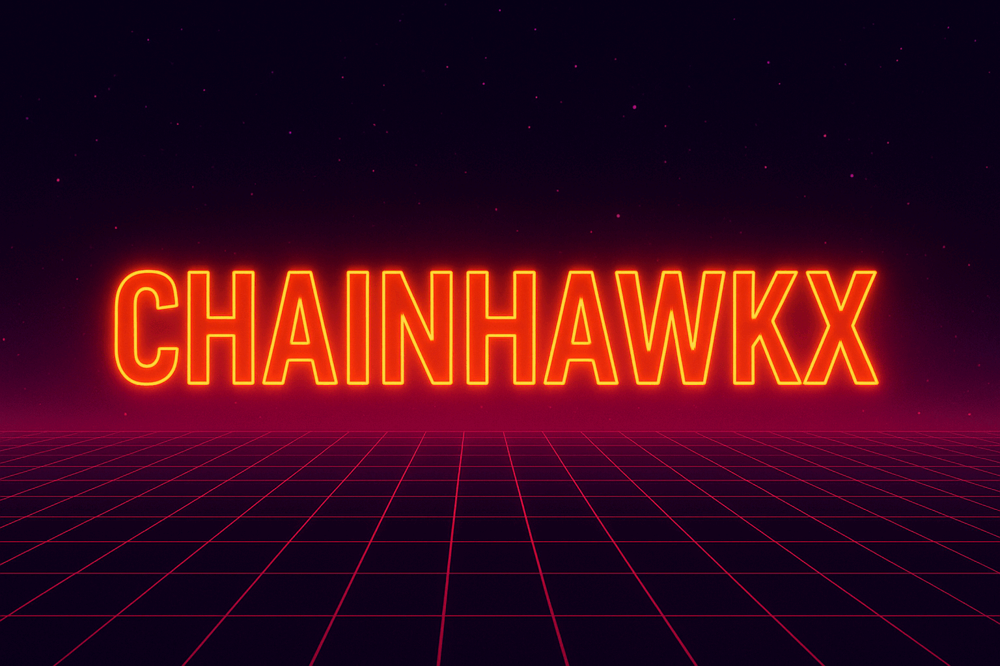

<!-- Premium Banner with Enhanced Styling -->

  

<!-- Animated Typing with Enhanced Visuals -->

  

---

## 💡 About Me
🚀 **Blockchain & Web3 Developer | Smart Contract Engineer | Decentralized Systems Builder**  
I'm passionate about creating **secure, scalable, and innovative blockchain solutions** that empower the future of decentralized technology.

---

## 🔗 Tech Arsenal

  
   
  <!-- Added Icons -->
  
  
  

---

## 🛠 Featured Projects

  <strong style="font-size: 1.1rem;">⚡ AtomicSwap Escrow:</strong> Trustless token swaps with pre-image verification 
  

    
    
  

  <strong style="font-size: 1.1rem;">🛡 NFT Marketplace:</strong> Secure, multi-chain NFT platform with custom royalty logic 
  

    
    
  

  <strong style="font-size: 1.1rem;">💳 Web3 Payment Gateway:</strong> MetaMask + Visa card integration for online stores 
  

    
    
  

---

## 📊 GitHub Stats

  
  

---

## 🏆 GitHub Achievements

  

---

## 🌍 Connect with Me

  
  
  
  

---

  💡 "Code is law, but secure code is freedom."

<!-- Premium Footer -->

  

